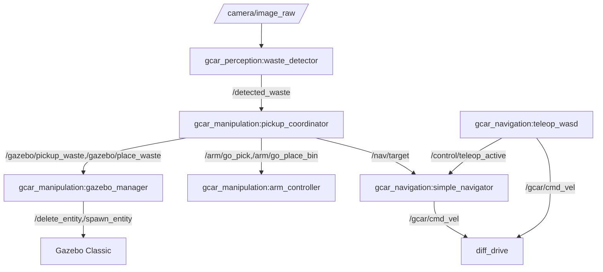

# Smart Autonomous Garbage Collection and Recycling Vehicle with Intelligent Planning and Human-Aware Interaction (GCAR)
## Simulation-Based Robotics Project — Implementation Report

### Project Title (as submitted)
**Smart Autonomous Garbage Collection and Recycling Vehicle with Intelligent Planning and Human-Aware Interaction (GCAR)**  
**Simulation-Based Robotics Project**

### Group Members
- Shmuye Ayalneh – UGR/7284/15  
- Dame Abera – UGR/0123/15  
- Abiy Hailu – UGR/8730/15  
- Natnael Eyuel – UGR/4424/15  
- Yamlak Ngeash – UGR/2910/15  
- Kaku Amsalu – UGR/3710/15  

---

## 1. Problem Statement
Urban centers in Ethiopia (e.g., Addis Ababa) face increasing solid waste management challenges, including public health risks, environmental pollution, inefficient collection workflows, and limited recycling due to weak source-level segregation. This project explores a robotics-based approach using simulation to demonstrate key capabilities needed for autonomous waste collection and separation.

---

## 2. Proposed Solution (Original) vs. Implemented Solution (Actual)

### 2.1 Original proposal (high-level)
The submitted proposal targeted a comprehensive GCAR system integrating:
- SLAM + ROS Navigation Stack (Nav2) for autonomous navigation with dynamic obstacle avoidance
- Deep-learning perception (CNN/YOLO) for waste classification and confidence-based decisions
- MoveIt!-based manipulation for pick/place and internal sorting compartments
- Smart bin logic (fill-level), learning-based route optimization, battery/energy awareness, fault recovery, and human-aware interaction.

### 2.2 Implemented solution (what we built)
Due to time and integration constraints, we implemented a **demo-oriented, modular ROS 2 Humble simulation** that still shows the full “detect → approach → pick → transport → place → handover” workflow, but using simpler components:

- **Simulation (Gazebo Classic / gazebo11)**: A custom city world with roads, sidewalks, bins, and colored waste cubes.
- **Perception (OpenCV color thresholding)**: Detects **red (general/hazard)** and **blue (recyclable)** objects from the robot camera.
- **Navigation (custom simple navigator)**: A lightweight proportional controller that drives toward target coordinates, with a safety buffer to avoid colliding with bins.
- **Safety (boundary monitor)**: Enforces operational bounds and issues emergency stop if the robot exits the allowed region.
- **Manipulation (ros2_control + JointTrajectoryController)**: Preset arm poses for pick/carry/place without MoveIt configuration overhead.
- **“Magic pickup/place” (Gazebo entity delete/spawn)**: When “picking,” the waste cube is deleted from Gazebo; when “placing,” a recycled cube is spawned at the nearest bin.
- **Coordinator state machine (pickup_coordinator)**: Orchestrates the autonomous pipeline and supports operator handover via teleop.
- **Teleoperation handover**: Operator can override autonomous motion with WASD without terminating navigation nodes.

---

## 3. Why Changes Were Made (from Proposal)
Some proposal components were **intentionally simplified** to achieve a stable, working end-to-end demo in the available timeframe:

- **YOLO/CNN → OpenCV color thresholding**  
  - **Why**: Training/integration time, performance constraints, and dependency issues.
  - **Result**: Reliable color-based detection for controlled simulation objects (red/blue cubes).

- **Nav2/SLAM → Custom `simple_navigator`**  
  - **Why**: Nav2 configuration, costmap tuning, and goal handling were taking too long; we needed predictable behavior for demonstration.
  - **Result**: Fast, controllable waypoint driving using odometry feedback.

- **MoveIt! → Preset joint trajectories**  
  - **Why**: MoveIt setup and kinematic tuning is time-heavy; for a 3-DOF arm, preset trajectories are sufficient for a demonstration.
  - **Result**: Accurate and repeatable arm motions using `ros2_control`.

- **Real grasping/physics → “Magic pickup/place”**  
  - **Why**: Grasping in simulation is complex (contacts, friction, grasp constraints). For this project demo, the goal is visual correctness and autonomy flow.
  - **Result**: Waste visibly disappears on pickup and appears in the bin on drop.

- **Human-aware interaction (full) → Practical operator handover**  
  - **Why**: Full pedestrian detection and social navigation is beyond scope for this timeline.
  - **Result**: Clean teleop takeover (WASD) without killing autonomous nodes.

---

## 4. System Architecture (Implemented)

### 4.1 ROS 2 Packages and Responsibilities

- **`gcar_description`**
  - Robot URDF/Xacro
  - `ros2_control` hardware interfaces for simulation
  - Controller config: `config/arm_controllers.yaml`

- **`gcar_simulation`**
  - Gazebo world: `worlds/city.world`
  - Contains roadside bins and colored waste cubes

- **`gcar_perception`**
  - Node: `waste_detector.py`
  - Subscribes: `/camera/image_raw`
  - Publishes: `/detected_waste` (`std_msgs/String`: `red_waste` or `blue_waste`)
  - Includes **confidence filtering** via:
    - bottom-half image gating
    - minimum contour area threshold
    - 5-frame consecutive voting confirmation

- **`gcar_navigation`**
  - Node: `simple_navigator.py`
  - Subscribes: `/nav/target` (`geometry_msgs/Point`)
  - Publishes: `/gcar/cmd_vel`
  - Subscribes: `/control/teleop_active` to yield to operator
  - Includes safe-distance stopping to avoid touching bins
  - Node: `teleop_wasd.py` publishes `/gcar/cmd_vel` and `/control/teleop_active`

- **`gcar_safety`**
  - Node: `boundary_monitor.py`
  - Enforces a bounded region; publishes stop commands at high rate when out-of-bounds

- **`gcar_manipulation`**
  - Node: `arm_controller.py` (preset poses via `JointTrajectoryController`)
  - Node: `gazebo_manager.py` (delete/spawn waste entities; global waste tracking)
  - Node: `pickup_coordinator.py` (state machine to coordinate detect → drive → pick → drive → place)

### 4.2 Dataflow Overview

---

## 5. Key Features Achieved

### 5.1 Waste detection (camera-based)
- Detects **red** and **blue** waste cubes reliably in the city world.
- Uses a **5-frame consecutive confirmation** to reduce false triggers.
- Uses **bottom-half gating** and minimum contour filtering to reduce “far-away” hallucinations.

### 5.2 Autonomous navigation (demo)
- Drives to targets using odometry-based proportional control.
- Includes a **collision buffer** (stops ~0.8m before target).
- Includes a **navigation safety abort** in the coordinator: if distance to the chosen bin increases significantly, it aborts to prevent leaving the city.

### 5.3 Safety enforcement
- Boundary monitor enforces a safe region and triggers emergency stop when out-of-bounds.

### 5.4 Arm manipulation (preset trajectories)
- Arm can move to HOME / PICK_FRONT / CARRY (internal pose) / PLACE_BIN via services.

### 5.5 “Magic pickup/place” with global waste tracking
- Pickup deletes the nearest waste model within a radius; prevents double-picking.
- Place spawns a uniquely named recycled model, preventing duplicate spawns (“ghost spawning”).
- Tracks active vs picked sets to keep the world consistent.

### 5.6 Operator handover (human-aware interaction, practical form)
- WASD teleop can temporarily override autonomous driving.
- Navigator yields control when teleop is active.
- After placement or abort, system returns to **IDLE** and operator can drive.

### 5.7 Manual bin approach auto-drop (recovery behavior)
- If autonomous navigation aborts but the robot is still carrying waste, **manually driving near the nearest correct bin triggers an automatic drop** (within ~1.5m), enabling smooth demo recovery.

---

## 6. How to Run / Test (High-Level)
This project was developed for **ROS 2 Humble** on Linux.

### Typical demo launch order (multi-terminal)
1. Spawn simulation and robot
2. Start arm controllers + arm controller node
3. Start gazebo manager
4. Start waste detector
5. Start simple navigator
6. Start pickup coordinator
7. (Optional) start teleop WASD for operator override

> Exact commands may vary depending on your workspace build/source. See the project README/testing notes in the repository.

---

## 7. Results / Demonstration Summary
We achieved a stable simulation demo where:
- The robot detects colored waste,
- Approaches/picks it (magic delete),
- Navigates to the nearest correct bin,
- Places it (magic spawn),
- Returns to IDLE for operator control,
- Prevents repeated ghost detections at bins and prevents duplicated spawns,
- Supports teleop takeover and safe abort to avoid driving off-map.

---

## 8. What Was Not Completed (Due to Time / Constraints)
The following original proposal components were not fully implemented:

- **SLAM and full Nav2 stack integration** (mapping, localization, costmaps, planners)
- **Learning-based route optimization** and historical waste prioritization
- **Dynamic pedestrian simulation + human-aware navigation behaviors** (social navigation)
- **True deep learning classification (YOLO/CNN)** for real-world generalization
- **Smart bin fill-level estimation** and threshold-triggered collection
- **Battery/energy monitoring and return-to-charge behavior**
- **Full fault detection + recovery framework** (beyond basic abort/stop behaviors)
- **Internal multi-compartment sorting mechanism** (physical compartments modeled + placement logic)
- **Multi-robot coordination** (conceptual only)

---

## 9. Limitations
- Color-threshold perception is suitable for controlled simulation objects but is not robust to real-world lighting/texture variation.
- “Magic pickup/place” does not model real grasp physics; it is a demo simplification.
- Navigation is waypoint/proportional-control based; it does not avoid obstacles like a full Nav2 setup.
- Bin interaction is coordinate-based; it assumes bins are static and known.

---

## 10. Future Work / Recommendations
If time allows, the next strongest upgrades are:
1. Replace `simple_navigator` with Nav2 (AMCL/SLAM, planners, recovery behaviors).
2. Add obstacle-aware driving and better local planning in crowded areas.
3. Replace color thresholding with trained detection (YOLO) + depth-based distance estimation.
4. Add true grasping (gripper/contact constraints) or robust attach/detach link simulation.
5. Add bin fill-level simulation and decision logic (collect only when full).
6. Add battery simulation and return-to-base behaviors.

---

## 11. Individual Contributions (as implemented)
This section reflects the actual implemented modules and integration work done during development:

- **Environment & Infrastructure**
  - City world setup, roads/sidewalk leveling, placement of bins and waste

- **Vehicle & Modeling**
  - URDF/Xacro integration and ros2_control configuration for arm joints

- **Perception**
  - Color-threshold waste detection, confidence filtering (voting + gating)

- **Manipulation**
  - Preset arm poses and joint trajectory control using ros2_control
  - Magic pickup/place services interacting with Gazebo

- **Navigation & Integration**
  - Custom navigator with safe stopping behavior
  - Teleop override and control handover design

- **Mission/Coordination**
  - State machine coordinator for detect→pickup→navigate→place
  - Safety abort logic and recovery via manual bin approach auto-drop

---

## 12. Conclusion
Although the full scope of the original GCAR proposal (Nav2+SLAM, YOLO, MoveIt, learning-based planning, energy awareness, and full human-aware interaction) was not completed within the available time, we successfully delivered a working ROS 2 Humble + Gazebo simulation that demonstrates the core autonomous waste-collection loop with safety controls, robust demo behavior, and practical operator handover. This provides a strong foundation for future expansion toward the original research-grade system.

